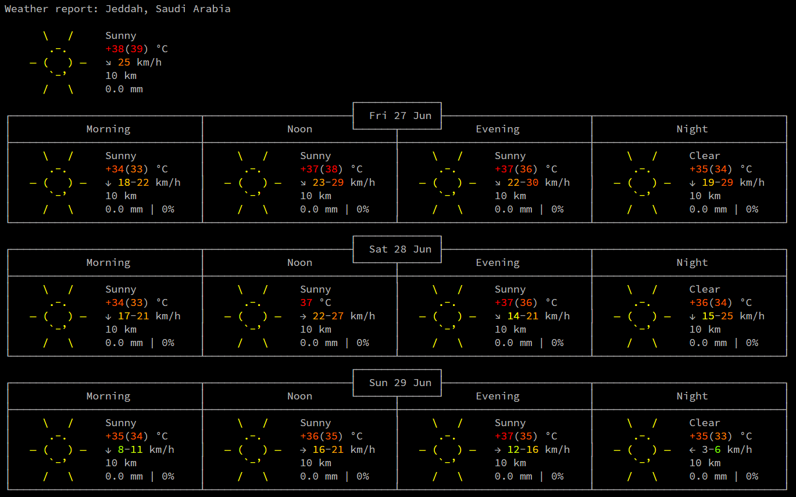
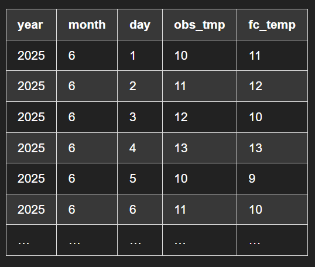

# 🌦️ Weather Forecast Logger (Casablanca)

A simple Bash script that fetches **daily observed and forecasted temperatures** for **Casablanca** using [wttr.in](https://wttr.in) and logs the data into a `.tsv` file.

---

## 📌 Features

- 📅 Automatically grabs the **current date**
- 🌡️ Extracts:
  - **Observed temperature** (current actual temperature)
  - **Forecasted temperature** (mid-day prediction for the next day)
- 📂 Appends the data into `weather_report.tsv`
- 🖼️ Includes screenshots for every major step in the process

---

## 🧰 Requirements

- Unix-based shell (`bash`)
- [`curl`](https://curl.se/)
- [`jq`](https://stedolan.github.io/jq/)

To install `jq`, run:

```bash
sudo apt install jq
```
## 📂 Project Structure
```
weather-forecast-project/
│
├── code.sh                      # Main bash script
├── weather_report.tsv           # Auto-generated data log
├── README.md                    # This file
│
├── screenshots/                 # Step-by-step images
│   ├── 01-declaring-the-important-values.png
│   ├── 02-exporting-the-data-from-website.png
│   ├── 03-declare-the-observed-and-forcasted-temperature.png
│   ├── 04-declaring-file.png
│   ├── 05-making-new-file-if-it-doesnt-exist.png
│   ├── 06-otherwise-save-a-new-line-of-the-data.png
│   ├── json data.png
│   └── weather report.png

```
## 💻 Script Breakdown

### 🟨 1. Declaring Date Variables

```bash
YEAR=$(date +%Y)
MONTH=$(date +%m)
DAY=$(date +%d)
```

---

### 🟨 2. Fetching Weather JSON from wttr.in
Using `curl`, we fetch the weather data for Casablanca in JSON format.

```bash
curl -s "wttr.in/casablanca?format=j1" -o weather.json
```

---

### 🟨 3. Extracting Temperatures
Extract the observed temperature and the forecasted temperature from the JSON using `jq`.

```bash
OBS=$(jq -r '.current_condition[0].temp_C' weather.json)
FC=$(jq -r '.weather[1].hourly[4].tempC' weather.json)
```

---

### 🟨 4. Declaring the Output File
The script defines the file name `weather_report.tsv` where the data will be saved.

```bash
FILE="weather_report.tsv"
```

---

### 🟨 5. Creating File with Headers (if it doesn’t exist)
If the file is missing, it gets created with appropriate column headers.

```bash
if [ ! -f "$FILE" ]; then
    echo -e "year\tmonth\tday\tobs_temp\tfc_temp" > "$FILE"
fi
```

---

### 🟨 6. Appending New Data
A new line with the current date and temperatures is appended to the file.

```bash
echo -e "${YEAR}\t${MONTH}\t${DAY}\t${OBS}\t${FC}" >> "$FILE"
```

---

### 🟨 7. Raw JSON Sample
This screenshot shows the raw JSON response structure from the API.



---

### 🟨 8. Final Output Preview
How the final TSV file looks like after running the script for several days.



---

# 🏗️ Potential Improvements
- Add support for multiple cities
- Convert output to `.csv` or database format
- Schedule with `cron` for automation

---

## Author

Made by [@abdlrhmanfahd](https://github.com/abdlrhmanfahd)


